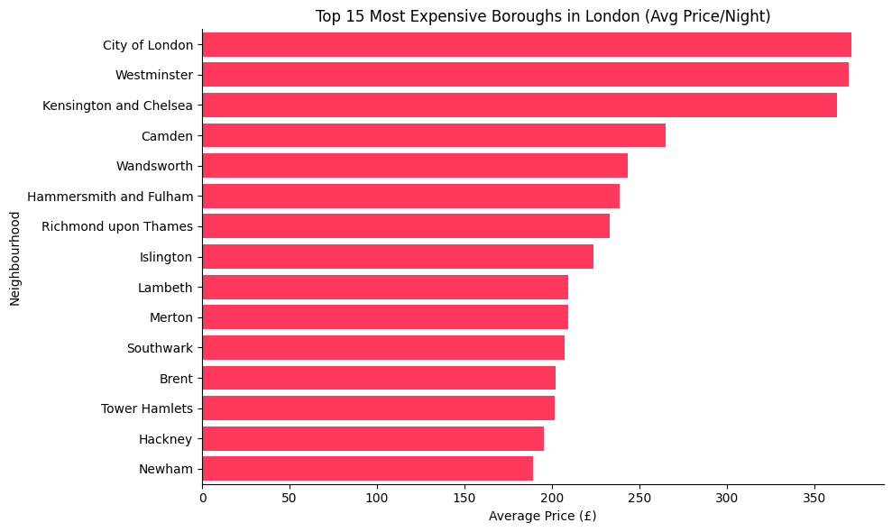

# 🏠 London Airbnb Market Analysis

> An end-to-end data analysis project exploring pricing, room types, and host patterns across London's Airbnb market — from raw data to a polished presentation.

## 🎯 Objective

This project analyzes 90,000+ London Airbnb listings to answer:

- Which boroughs command the highest prices, and which have the most supply?
- How does room type (entire home vs private room) influence pricing?
- Does pricing relate to how often a listing is booked or reviewed?
- Is the market dominated by individual hosts or large-scale operators?

## 📂 Data Source

| | |
|---|---|
| **Source** | [Inside Airbnb](http://insideairbnb.com/get-the-data/) — London listings |
| **Raw dataset** | 92,799 listings × 19 columns |
| **Cleaned dataset** | 61,774 listings × 17 columns |

## 🧹 Data Cleaning

- Dropped `neighbourhood_group` and `license` — both 100% empty
- Removed rows with missing `price` (~30,400 rows)
- Capped `price` at the 99th percentile to remove extreme outliers
- Converted `last_review` to proper date format

## 📈 Key Insights

- **📍 Location drives price more than volume** — City of London is priciest (avg. **£371/night**), while Westminster has the most listings (8,000+) — they're not the same borough.
- **🏘️ Room type is a major price lever** — entire homes/apartments command higher and more variable prices than private rooms.
- **🏢 The market is whole-property dominated** — **67.3%** of listings are entire homes; shared/hotel rooms make up under 1% combined.
- **📉 Price weakly predicts bookings** — both availability and review count show only weak correlation with price.
- **💼 Professional hosting exists at scale** — the top host manages **463 listings**, pointing to commercial property management rather than individual homeowners.

## 🛠️ Tools Used

- **Python** — Pandas for cleaning and analysis
- **Matplotlib / Seaborn** — data visualization
- **Google Colab** — development environment
- **PowerPoint (pptxgenjs)** — final presentation deck

## 🎨 Presentation

The full analysis is presented as a **15-slide deck**, covering objective, methodology, data cleaning, 8 visual analyses, key insights, and recommendations — styled in Airbnb's brand color (`#FF385C`).

📎 [View as PDF](London_Airbnb_Market_Analysis.pdf) | [Download PPTX](London_Airbnb_Market_Analysis.pptx)

---

⭐ If you found this project useful, consider giving it a star!
